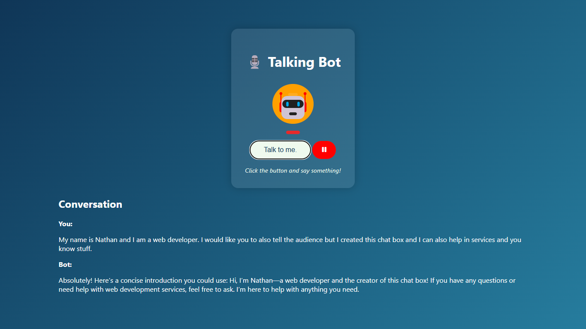

# 🎙️ Talking Bot

A real-time web-based AI assistant that lets you talk to a bot and receive vocal responses. Built using:
- **Web Speech API** (`speechRecognition`, `speechSynthesis`)
- **Socket.IO**
- **Express.js**
- **OpenAI GPT**
  
This project turns your browser into an interactive AI conversation tool.

---

## 🔧 Technologies Used

- 🧠 **OpenAI GPT** – for generating intelligent responses
- 🗣️ **Web Speech API**
  - `speechRecognition` – captures and transcribes your voice
  - `speechSynthesis` – converts bot responses to speech
- 🔌 **Socket.IO** – real-time communication between client and server
- 🌐 **Express.js** – lightweight backend server

---

## 📸 Demo

 <!-- Replace with your actual image path -->

---

## 🚀 Getting Started

### 1. Clone the repo
```bash
git clone https://github.com/your-username/talking-bot.git
cd talking-bot
